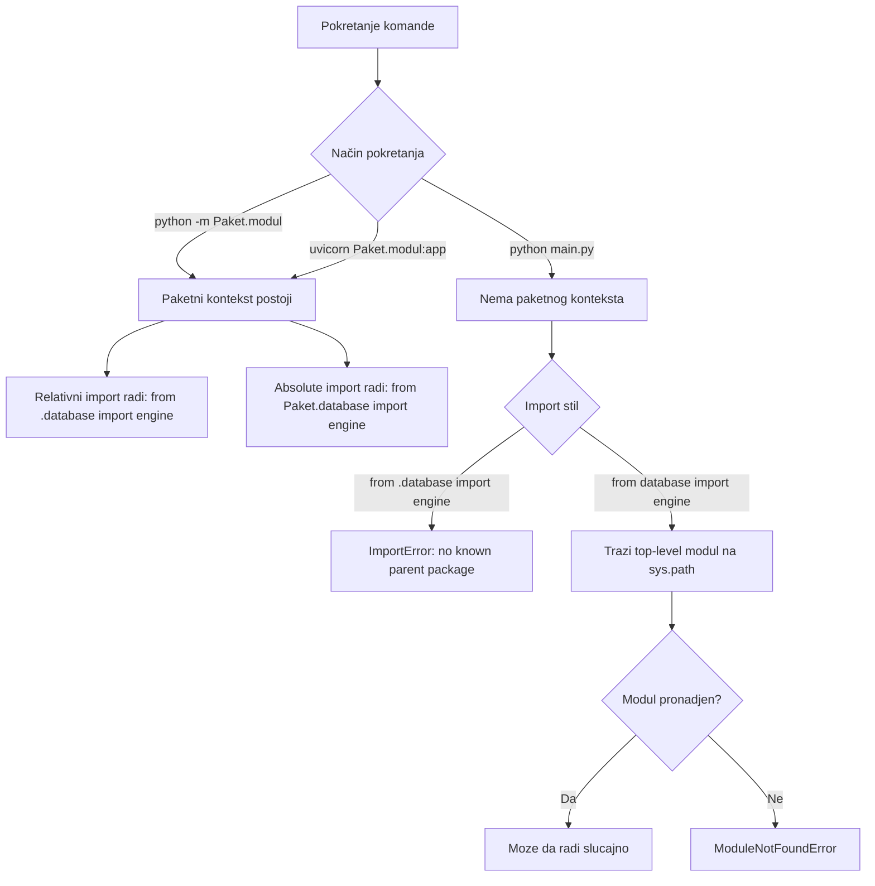

# Importi i pokretanje skripti u FastAPI aplikaciji

Ovaj vodič objašnjava kako Python zaista rešava importe u `FastAPI` projektu, zašto isti kod nekad radi a nekad puca, i koji način pokretanja je profesionalno preporučen.

## 1) Mentalni model: kako Python traži module

Kada napišeš import, Python traži modul ovim redosledom:

1. Trenutni paket (ako se kod izvršava kao paket tj. koristi se paketni kontekst folder + `__init__.py`)
2. Putanje iz `sys.path`
3. Instalirani paketi iz okruženja

Ključ:

- Import ne zavisi od toga gde je fajl fizički otvoren u editoru.
- Import zavisi od načina na koji je proces pokrenut.

Zato su importi i komanda pokretanja uvek vezani.

### 1.1) Dijagram toka import rezolucije



Brzo pravilo: ako hoćeš predvidljivo ponašanje, pokreći aplikaciju kao paket.

```bash
# Pokretanje aplikacije kao paket
python -m Paket.modul
uvicorn Paket.modul:app
```

---

## 2) Apsolutni i relativni import

### Apsolutni import

```python
from TodoApp.database import engine
```

Prednosti:

- Jasan put od korena paketa
- Stabilan u većim projektima

Mane:

- Moraš pokretati kod tako da Python vidi koren paketa

```bash
# Pokretanje aplikacije sa apsolutnim importom
python -m TodoApp.main
uvicorn TodoApp.main:app
```
- Napomena: Uvek pokreći aplikaciju iz korena paketa kako bi apsolutni importi radili ispravno u suprotnom može doći do grešaka.

---

### Relativni import

```python
from .database import engine
from . import models
```

Prednosti:

- Kratko i praktično unutar istog paketa. To znači da su svi moduli u istom paketu (folder sa `__init__.py`).
- Dobro radi kada modul pokrećeš kao deo paketa.

```bash
# Pokretanje aplikacije sa relativnim importom
python -m TodoApp.main
uvicorn TodoApp.main:app
```

Mane:

- Puca kod direktnog pokretanja fajla (`python main.py`)

---

## 3) Šta znači tačka u importu

U izrazu:

```python
from . import models
```

tačka znači: uzmi iz trenutnog paketa.

To nije isto što i trenutni folder iz kog si otvorio terminal.
To je paketni kontekst koji Python zna kroz `__package__`.

Ako modul nema paketni kontekst, relativni import ne može da se razreši.

---

## 4) Razlika između `from .database import engine` i `from database import engine`

### Relativni

```python
from .database import engine
```

- Traži `database` modul u istom paketu
- Zahteva paketni način pokretanja

---

### Top-level (bez tačke)

```python
from database import engine
```

- Traži top-level modul `database` na `sys.path`
- Može raditi slučajno kada si u istom folderu
- Često puca u realnim okruženjima, testovima, CI i produkciji

Praksa:

- Unutar paketa koristi relativne importe ili pune apsolutne iz korena paketa.
- Izbegavaj neodređene top-level importe u internom kodu paketa

PITANJE: Ako se `main.py` nalazi u root-u projekta (paketa), a base.py sa Base klasom u nekom podpaketu, kako pravilno importovati Base u main.py?

Odgovor: U terminalu treba da se nalaziš u root-u projekta i koristiš apsolutni import iz korena paketa. Na primer:

```python
from podpaket.base import Base
```
- Napomena: Ovaj pristup zahteva da se uvek pokrećeš iz root-a projekta kako bi apsolutni importi radili ispravno. Pokretanje:

```bash
cd root_projekta
python -m main
uvicorn main:app --reload --host 0.0.0.0 --port 8000
```
PITANJE: Ako se `main.py` nalazi u root-u projekta, a base.py sa Base klasom u podpaket/subpaket/?

Odgovor: U terminalu treba da se nalaziš u root-u projekta i koristiš apsolutni import iz korena paketa. Na primer:

```python
from podpaket.subpaket.base import Base
```
Napomena: Ovaj pristup zahteva da se uvek pokrećeš iz root-a projekta kako bi apsolutni importi radili ispravno. Pokretanje:

```bash
cd root_projekta
python -m main
uvicorn main:app --reload --host 0.0.0.0 --port 8000
```
PITANJE: Šta znače `..` u relativnim importima?

Odgovor: `..` znači idi jedan nivo iznad trenutnog paketa. Na primer:

```python
from ..subpaket import modul
```
NAPOMENA: Kod relativnih importa kao u kod apsolutnih, važno je da skriptu pokrećeš iz root-a paketa kako bi Python znao kontekst trenutnog paketa.

---

## 5) Zašto `python main.py` često pravi probleme

Kada pokreneš:

```bash
python main.py
```

taj fajl postaje entrypoint skripta i Python ga tretira kao samostalni modul.
U tom režimu relativni importi (`from .database ...`) nemaju dovoljno informacija o paketu.

Tipična greška:

```text
ImportError: attempted relative import with no known parent package
```

---

## 6) Profesionalni način pokretanja FastAPI paketa

Pretpostavimo strukturu:

```text
Project_3/
  TodoApp/
    __init__.py
    main.py
    database.py
    models.py
```

Pokretanje iz foldera iznad paketa:

```bash
cd Project_3
uvicorn TodoApp.main:app --reload
```

Ili kao Python modul:

```bash
cd Project_3
python -m TodoApp.main
```

Ovim pristupom relativni importi rade stabilno.

---

## 7) FastAPI primer: minimalni stabilan paketni setup

### `database.py`

```python
from sqlalchemy import create_engine
from sqlalchemy.ext.declarative import declarative_base
from sqlalchemy.orm import sessionmaker

SQLALCHEMY_DATABASE_URL = "sqlite:///./todosapp.db"

engine = create_engine(
    SQLALCHEMY_DATABASE_URL,
    connect_args={"check_same_thread": False},
)

SessionLocal = sessionmaker(autocommit=False, autoflush=False, bind=engine)
Base = declarative_base()
```

---

### `models.py`

```python
from sqlalchemy import Boolean, Column, Integer, String
from .database import Base


class Todos(Base):
    __tablename__ = "todos"

    id = Column(Integer, primary_key=True, index=True)
    title = Column(String)
    description = Column(String)
    priority = Column(Integer)
    complete = Column(Boolean, default=False)
```

NAPOMENA: Imena tabela u bazi podataka se obično pišu malim slovima i u množini, dok su klase modela u CamelCase.

---

### `main.py`

```python
from fastapi import FastAPI

from . import models
from .database import engine

app = FastAPI()

models.Base.metadata.create_all(bind=engine)
```

Napomena:

- `from . import models` je bitan da SQLAlchemy registruje modele pre `create_all`.

---

## 8) Kada koristiti fallback `try/except ImportError`

Fallback obrazac:

```python
try:
    from . import models
    from .database import SessionLocal, engine
except ImportError:
    import models
    from database import SessionLocal, engine
```

Koristi se kada namerno želiš da isti fajl radi i:

- kao deo paketa
- kao direktna skripta

Za produkcioni i timski rad ovo je obično nepotrebno i povećava kompleksnost.
Čistije je imati jedan standard: paketno pokretanje.

---

## 9) Pylance upozorenja i `type: ignore`

Ako ukloniš `type: ignore` u fallback importu, Pylance često prijavi:

- missing imports
- missing library stubs

Razlog:

- statički analizator procenjuje import putanje iz trenutnog workspace konteksta
- fallback grane mogu izgledati neispravno iz njegove perspektive

Bitno:

- `type: ignore` skriva simptom
- ne rešava arhitekturu importa

Ako želiš čist kod bez ignore komentara, koristi dosledan paketni režim.

---

## 10) Česte greške i kako da ih rešiš

### Greška 1

```text
attempted relative import with no known parent package
```

Rešenje:

- Ne pokreći fajl direktno
- Pokreni paket:

```bash
cd Project_3
uvicorn TodoApp.main:app --reload
```

### Greška 2

```text
ModuleNotFoundError: No module named 'database'
```

Rešenje:

- Izbegni `from database import ...` unutar paketa
- Koristi `from .database import ...`

### Greška 3

Aplikacija radi, ali tabela nije kreirana.

Rešenje:

- Proveri da su modeli importovani pre `create_all`

---

## 11) Komande koje treba zapamtiti

```bash
# Pokretanje FastAPI aplikacije kao paket
cd Project_3
uvicorn TodoApp.main:app --reload

# Pokretanje modula kroz Python package mehanizam
cd Project_3
python -m TodoApp.main
```

Nemoj koristiti kao glavni workflow:

```bash
python TodoApp/main.py
```

---

## 12) Pravilo za ovaj kurs

Za stabilan napredak kroz FastAPI lekcije koristi jedno pravilo:

1. Kod u paketu piši sa relativnim importima ili jasnim apsolutnim iz korena paketa.
2. Aplikaciju pokreći iz foldera iznad paketa.
3. Koristi `uvicorn Paket.modul:app --reload`.
4. Izbegavaj fallback import osim ako baš vežba zahteva direktno pokretanje skripte.

Ako ovo poštuješ, import problemi se drastično smanjuju.
