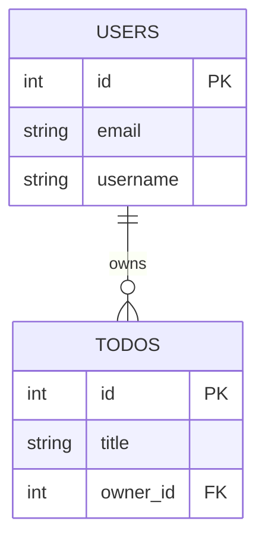

# Stage 2 - Setup Database

## Lekcija 02 - Database Tables and Models (SQLAlchemy ORM)

## 0) Šta je cilj ove lekcije

U prethodnoj lekciji si napravio konekciju sa bazom (`database.py`).
U ovoj lekciji pravis ORM modele u `models.py`, odnosno `Python klase` koje predstavljaju `SQL tabele`.

Kratko:

- `database.py` = kako se povezuješ na bazu
- `models.py` = koje tabele i kolone postoje

Bez `models.py` SQLAlchemy ne zna tačno šta treba da kreira u bazi.

---

## 1) Šta transkript pokriva (verno lekciji)

Transkript fokusira jednu glavnu ideju:

1. Kreiraš `models.py`
2. Uvezeš `Base` iz `database.py`
3. Definišeš klasu (tabelu), npr. `Todos`
4. Dodaš `__tablename__`
5. Dodaš kolone (`id`, `title`, `description`, `priority`, `complete`)

To je minimalni ORM setup koji omogućava da se tabela kreira kasnije preko:

```python
models.Base.metadata.create_all(bind=engine)
```

---

## 2) Kako SQLAlchemy "razume" tvoju tabelu

SQLAlchemy ORM čita Python klasu i mapira je na SQL tabelu.

Primer mentalnog modela:

- klasa `Todos` -> tabela `todos`
- atribut `id = Column(Integer, primary_key=True)` -> kolona `id INTEGER PRIMARY KEY`
- jedna instanca klase `Todos(...)` -> jedan red u tabeli `todos`

Dakle, ORM je prevodilac između Python objekata i SQL reda/kolona.

---

## 3) Analiza tvog stvarnog models.py (Project 3)

Tvoj trenutni fajl u Project 3:

- ima dve tabele (`Users`, `Todos`)
- koristi i `ForeignKey` (`owner_id` pokazuje na `users.id`)

To znači da je tvoj kod već iznad minimalnog nivoa iz transkripta, što je odlično.

### 3.1 Imports

```python
from sqlalchemy import Boolean, Column, ForeignKey, Integer, String
```

Ovo su SQL tipovi i gradivni elementi kolona.

```python
try:
    from .database import Base
except ImportError:
    from database import Base  # type: ignore
```

Ovo je kompatibilnost za dva načina pokretanja python skripti:

- package mode predstavlja pokretanje unutar paketa, npr. `python -m package.module`
- script mode predstavlja pokretanje direktno skripte, npr. `python script.py`

Za početnika je najbitnije da razumeš: `Base` je roditelj svih modela.

---

### 3.2 Users tabela

```python
class Users(Base):
    __tablename__ = "users"
```

`__tablename__` je stvarno ime tabele u bazi.

Kolone:

- `id`: integer, primarni kljuc
- `email`: string, unique
- `username`: string, unique
- `first_name`, `last_name`: string
- `hashed_password`: string
- `is_active`: boolean, default `True`
- `role`: string

---

### 3.3 Todos tabela

```python
class Todos(Base):
    __tablename__ = "todos"
```

Kolone:

- `id`: integer, primarni ključ (Primary Key)
- `title`: string
- `description`: string
- `priority`: integer
- `complete`: boolean, default `False`
- `owner_id`: integer, strani ključ (Foreign Key) ka `users.id`

`owner_id = Column(Integer, ForeignKey("users.id"))` je prva prava relacija.

Time svaki todo pripada nekom user-u u bazi. Ovo je realizovano kroz `ForeignKey` vezu.

Objasnimo: `ForeignKey` veza osigurava da svaki `owner_id` u tabeli `todos` odgovara nekom `id` u tabeli `users`. To znači da ne može postojati `todo` bez validnog vlasnika u bazi. Pošto je `id` unikatan (nema duplikata), svaki `owner_id` će uvek pokazivati na tačno jednog korisnika u tabeli `users`. Time se omogućava referencijalni integritet između tabela.(slično kao `PRIMARY KEY` za pojedinačne tabele)

`ForeignKey` je ključni mehanizam za održavanje referencijalnog integriteta u relacijskim bazama podataka.

---

## 4) Objašnjenje najvažnijih Column opcija

### `primary_key=True`

Kažemo SQL-u: ovo je glavni identifikator reda.
Mora biti jedinstven i stabilan.

### `index=True`

Kreira se `indeks` nad kolonom (zavisi od baze i migracija/kreiranja).
Pomaže brze pretrage, npr. po `id`.

### `unique=True`

Sprečava duplikate.
Primer: dva user-a ne mogu imati isti `email`.

### `default=...`

Ako ne pošalješ vrednost, uzima se default.
Primer: `complete=False` znači da je novi todo po defaultu ne-završen.

### `ForeignKey("users.id")`

Referencijalni integritet (referential integrity):
`owner_id` u `todos` mora pokazivati na postojeći `users.id`.

---

## 5) Transcript vs tvoj repo: zašto se razlikuju

U transkriptu lekcija 02 objašnjava pre svega `Todos` tabelu.
U tvom kodu već postoje i `Users` + `owner_id` relacija.

To je normalno jer:

- kurs ide progresivno
- neki fajlovi u repo-u su iz kasnijih koraka

Zato je najbolja praksa da gledaš:

1. šta lekcija uvodi kao koncept
2. kako je taj koncept proširen u finalnom kodu

---

## 6) Kako tabele stvarno nastaju u SQLite bazi

Model sam po sebi ne kreira tabelu odmah.
Tabela nastaje kada se izvrši:

```python
models.Base.metadata.create_all(bind=engine)
```

U tvom projektu to je u `main.py` fajlu.

```sql
.tables
.schema users
.schema todos
```

Ako tabela ne postoji, najčešće su razlozi:

- nisi pokrenuo app ili skriptu koja zove `create_all`
- otvorio si pogrešan `.db` fajl
- modeli nisu importovani pre `create_all`

---

## 7) Mini SQL slika iza modela

Priblizno, ORM definicije bi dale SQL ideju sličnu ovoj:

```sql
CREATE TABLE users (
    id INTEGER PRIMARY KEY,
    email VARCHAR UNIQUE,
    username VARCHAR UNIQUE,
    first_name VARCHAR,
    last_name VARCHAR,
    hashed_password VARCHAR,
    is_active BOOLEAN DEFAULT 1,
    role VARCHAR
);

CREATE TABLE todos (
    id INTEGER PRIMARY KEY,
    title VARCHAR,
    description VARCHAR,
    priority INTEGER,
    complete BOOLEAN DEFAULT 0,
    owner_id INTEGER,
    FOREIGN KEY(owner_id) REFERENCES users(id)
);
```

Napomena: tačan SQL može blago varirati po dijalektu i verziji.

`VARCHAR` tip u SQL-u se koristi za kolone koje čuvaju tekstualne podatke promenljive dužine. Na primer, `email VARCHAR UNIQUE` znači da kolona `email` može čuvati tekstualne vrednosti i da svaka vrednost mora biti jedinstvena.

---

## 8) Dobre navike koje su bitne već sada

1. Razdvajaj odgovornosti

- `database.py`: engine/session/base
- `models.py`: tabele

2. Nemoj overfit-ovati sve u jednoj klasi

- jedna tabela = jedan jasan entitet

3. Razmišljaj o integritetu od starta

- `unique`, `foreign key`, `default`, posle i `nullable=False` (ne zaboravi na `CHECK` ograničenja ako je potrebno)

`CHECK` ograničenja se koriste za definisanje uslova koje vrednosti u koloni moraju zadovoljiti. Na primer, možeš koristiti `CHECK(priority >= 0 AND priority <= 5)` da osiguraš da vrednost kolone `priority` bude između 0 i 5.

4. Čuvaj semantiku imena

- tabela plural (`users`, `todos`)
- kolona koja referencira user-a: `owner_id`

---

## 9) Česte početničke greške baš u ovoj lekciji

1. Mešanje Pydantic modela i SQLAlchemy modela

- `Pydantic` je za API ulaz/izlaz
- `SQLAlchemy` je za bazu

2. Misliš da je `index=True` isto što i `unique=True`

- nije isto
- indeks ubrzava, unique ograničava duplikate

3. Zaboravljen `ForeignKey`

- relacija ostaje samo "dogovor" u kodu, bez zaštite baze

4. Pokretanje iz različitih foldera

- kreiraš drugi `.db` fajl i deluje kao da "nema tabela"

---

## 10) Vežbe (od osnovnog ka srednjem)

## Vežba 1

Objasni svojim rečima razliku:

- `primary_key` služi za označavanje primarnog ključa u tabeli. On garantuje jedinstvenost i neophodnost vrednosti u toj koloni. Vrednost u primarnom ključu ne može biti `NULL` i ne može se ponavljati. Obično se ne menja, jer bi promena primarnog ključa mogla narušiti integritet podataka i veze između tabela.

- `unique` označava da vrednosti u toj koloni moraju biti jedinstvene. Ne dozvoljava duplikate, ali ne garantuje da kolona nije `NULL` (osim ako nije kombinovano sa `nullable=False`). U kombinaciji sa `nullable=False`, osigurava da svaka vrednost u koloni bude jedinstvena i ne `NULL`.

Razlika između `primary_key` i `unique` je u tome što `primary_key` automatski podrazumeva `unique` i `not null`, dok `unique` može biti primenjen na kolone koje nisu primarni ključ.

Ovo znači da kolona sa `primary_key` uvek ima jedinstvene i ne `NULL` vrednosti, dok kolona sa `unique` može biti `NULL` ako nije kombinovano sa `nullable=False`.

- `index` kreira indeks na toj koloni, što ubrzava pretrage po toj koloni. Ne garantuje jedinstvenost vrednosti u smislu `unique`.To znači da možeš imati duplikate u toj koloni, ali pretrage po njoj će biti brže. Ako pretražujemo `duplikate`, `indeks` će omogućiti `brže` pronalaženje svih odgovarajućih redova i vratiti sve duplikate brže. Zaključak je da `index` za razliku od `unique` ne ograničava duplikate, već samo poboljšava performanse pretrage.

Razlika između `index` i `unique` je u tome što `index` samo poboljšava performanse pretrage, dok `unique` dodatno ograničava duplikate. U odnosu na `foreign key`, `index` ne garantuje integritet (pod integritetom podataka se podrazumeva da su vrednosti u koloni validne i konzistentne/tačne), dok `foreign key` osigurava da vrednosti u koloni odgovaraju vrednostima u povezanoj tabeli.

---

## Vežba 2

Dodaj u `Todos` novo polje:

- `created_at` (za sada može `String` da ostane jednostavno)

```python
created_at = Column(String)
```

Pitanje: Šta treba da uradiš da se ta kolona zaista pojavi u bazi?

Da bi se ta kolona zaista pojavila u bazi, potrebno je ili kreirati novu migraciju i primeniti je, ili obrisati postojeću bazu i ponovo je kreirati sa `Base.metadata.create_all(engine)`. Bez ovoga, nova kolona neće biti dodata u postojeću tabelu.

---

## Vežba 3

Napravi mentalni ER odnos:

- jedan `Users`
- više `Todos`

Nacrtaj strelicu i objasni gde je `ForeignKey`.

`ForeignKey` se nalazi u tabeli `Todos` i pokazuje na primarni ključ u tabeli `Users`. To znači da svaki `Todo` mora imati validnog vlasnika (`owner_id`) koji postoji u tabeli `Users`.

Primer:

```python
owner_id = Column(Integer, ForeignKey("users.id"))
```

### Dijagram odnosa (jedan Users -> više Todos)



Čitanje dijagrama:

- `USERS ||--o{ TODOS` znači "jedan user prema nula-ili-više todos"
- `PK` pored `id` znači primarni ključ te tabele
- `FK` pored `owner_id` znači da ta kolona referencira primarni ključ druge tabele

### Kako `ForeignKey` povezuje `owner_id` sa `id` u `Users`

`owner_id` u tabeli `Todos` nije nezavisna vrednost, nego kopija postojećeg `id`-a iz tabele `Users`:

```python
class Users(Base):
    __tablename__ = "users"
    id = Column(Integer, primary_key=True, index=True)


class Todos(Base):
    __tablename__ = "todos"
    id = Column(Integer, primary_key=True, index=True)
    owner_id = Column(Integer, ForeignKey("users.id"))
```

Mehanizam:

1. `Users.id` je `primary_key=True`, što bazu obavezuje da ta vrednost bude jedinstvena i ne-`NULL` za svaki red.
2. `ForeignKey("users.id")` na koloni `owner_id` govori bazi: "svaka vrednost ovde mora tačno odgovarati nekoj postojećoj vrednosti u `users.id`".
3. Zato je odnos "jedan naspram jedan" na nivou pojedinačnog para `(owner_id, users.id)` — jedan `owner_id` uvek pokazuje na tačno jednog korisnika, jer `users.id` ne može imati duplikate.
4. Kada se to ponovi za više redova u `Todos` sa istim `owner_id`, dobija se odnos "jedan naspram više" na nivou tabela: jedan `User` može imati više `Todos`, ali svaki `Todo` ima tačno jednog vlasnika.

Baza ovo aktivno štiti: pokušaj da upišeš `owner_id` koji ne postoji u `users.id` bude odbijen (referencijalni integritet).

### Uloga `id` kao primarnog ključa u `Todos`

Bitno je razlikovati dve različite kolone u `Todos`:

- `id` (primarni ključ `Todos`): identifikuje **red u tabeli `Todos`**, tj. konkretan todo zapis. Ne govori ništa o vlasništvu.
- `owner_id` (strani ključ ka `Users`): identifikuje **kome taj todo pripada**, tj. povezuje red iz `Todos` sa redom iz `Users`.

Drugim rečima:

- `Todos.id` odgovara na pitanje: "koji je ovo tačno todo?"
- `Todos.owner_id` odgovara na pitanje: "čiji je ovaj todo?"

Ove dve kolone su nezavisne jedna od druge: `id` raste/postoji za svaki novi red bez obzira na vlasnika, dok `owner_id` može biti isti za više različitih `Todos` redova (jedan korisnik ima više zadataka), ali svaki od tih redova i dalje ima svoj jedinstveni `id`.

---

## Vežba 4

Nađi 2 mesta u kodu gde `owner_id` treba posebno proveravati zbog bezbednosti (autorizacija).

Primeri mesta gde `owner_id` treba posebno proveravati:

1. Kada korisnik pokušava da pristupi ili izmeni `Todo` koji nije njegov. Treba proveriti da li `owner_id` `Todo`-a odgovara `id`-u trenutno prijavljenog korisnika.
2. Kada korisnik pokušava da obriše `Todo`. Opet, treba proveriti da li `owner_id` `Todo`-a odgovara `id`-u trenutno prijavljenog korisnika.

---

## 11) Brza samoprovera razumevanja

Ako možeš tačno da odgovoriš na ova pitanja, lekcija je legla:

1. Zašto `class Todos(Base)` nasleđuje `Base`?

Nasleđuje `Base` da bi dobio sve funkcionalnosti SQLAlchemy modela, uključujući mapiranje na tabelu u bazi. Ovo omogućava da SQLAlchemy zna kako da interaguje sa tabelom u bazi kada izvršava upite.

2. Šta radi `__tablename__`?

Određuje ime tabele u bazi na koje će SQLAlchemy mapirati ovaj model. Bez ovog atributa, SQLAlchemy bi automatski generisao ime tabele na osnovu imena klase, što možda nije uvek poželjno.

3. Da li model odmah kreira tabelu sam od sebe?

Ne, model samo definiše strukturu. Tabela se kreira kada pozoveš `Base.metadata.create_all(engine)` ili koristiš migracije.

4. Čemu služi `ForeignKey("users.id")`?

Označava da kolona referencira primarni ključ u drugoj tabeli (`users.id`), čime se uspostavlja veza između tabela i omogućava integritet podataka. Ovo znači da baza neće dozvoliti unos vrednosti u `owner_id` koja ne postoji u tabeli `users`.

5. Zašto su `email` i `username` često `unique=True`?

Da bi se osiguralo da ne postoje duplikati u bazi, što je važno za identifikaciju korisnika i integritet podataka. Na primer, dva korisnika ne mogu imati isti email ili username.

---

## 12) Zaključak

Lekcija 02 deluje kratko, ali je ključna.
Ovde prvi put formalno definišeš strukturu podataka aplikacije.

Kad razumeš `models.py`, sledeći koraci (CRUD, auth, filtering, migracije) postaju logični jer svi zavise od dobrog modela.

U jednoj rečenici:
`database.py` otvara vrata baze, a `models.py` crta mapu kako baza izgleda.
