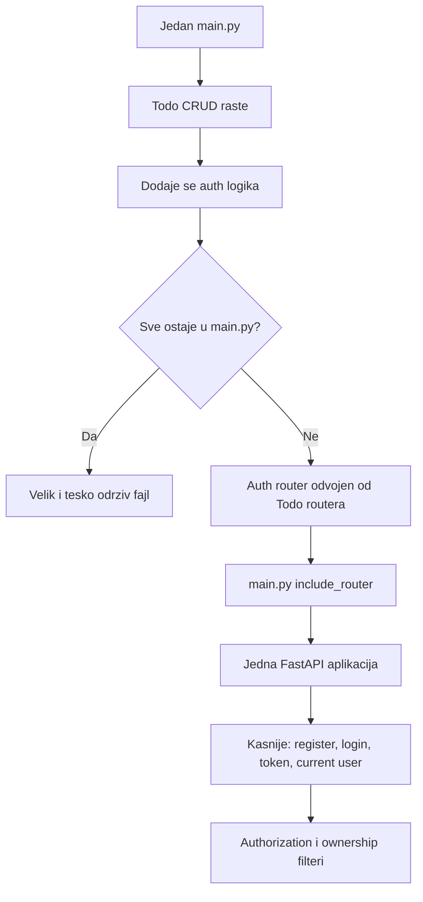

# Oblast 03 - Authentication and Authorization

## Lekcija 01 - Pocetak autentifikacije i autorizacije

Ova lekcija je uvod u novu veliku oblast FastAPI aplikacije: autentifikaciju i autorizaciju.

Transkript jos ne implementira pravi login, JWT ili proveru lozinke. Njegov prvi cilj je organizacioni:

- auth logika ne treba da bude pomesana sa todo logikom
- aplikacija treba da ostane citljiva kako raste
- rute treba postepeno izdvojiti u posebne module
- jedna FastAPI aplikacija treba da objedini sve funkcionalne oblasti

To je vazno razumeti pre nego sto se uvedu password hashing, tokeni i permissions.

---

## 1) Gde se sada nalazimo

Do ove oblasti aplikacija ima todo CRUD logiku u jednom `main.py` fajlu:

```python
@app.get("/")
async def read_all(db: db_dependency):
    return db.query(Todos).all()

@app.post("/todo")
async def create_todo(todo_request: TodoRequest, db: db_dependency):
    ...

@app.put("/todo/{todo_id}")
def update_todo(...):
    ...

@app.delete("/todo/{todo_id}")
def delete_todo(...):
    ...
```

Ovo je prihvatljivo za pocetak, jer ucis osnovni CRUD i DB lifecycle. Problem nastaje kada pocnes da dodajes:

- registraciju korisnika
- login
- proveru password-a
- generisanje tokena
- citanje trenutnog korisnika
- proveru administratorske role
- ogranicavanje pristupa todo zapisima

Ako se sve doda u isti `main.py`, fajl brzo postaje nepregledan.

---

## 2) Tri pojma koje sada uvodimo

### Authentication - autentifikacija

Autentifikacija odgovara na pitanje:

> Ko si ti?

Primeri:

- korisnik salje username i password
- aplikacija proverava da li korisnik postoji
- aplikacija proverava da li password odgovara sacuvanom hash-u
- aplikacija identifikuje korisnika

Rezultat moze biti:

```python
{
    "username": "ana",
    "id": 1,
    "role": "user",
}
```

### Authorization - autorizacija

Autorizacija odgovara na pitanje:

> Sta smes da uradis?

Primeri:

- obican korisnik moze da vidi samo svoje todos
- admin moze da vidi sve todos
- samo admin moze da obrise korisnika

Autorizacija dolazi nakon autentifikacije, jer aplikacija prvo mora znati ko je korisnik da bi proverila njegova prava.

### Routing - organizacija ruta

Routing nije autentifikacija, ali je organizaciona osnova za nju.

Auth endpointi treba da budu odvojeni od todo endpointa, na primer:

```text
/auth/login
/auth/register
/todos
/users
/admin
```

---

## 3) Zasto auth ne treba mesati sa todo logikom

Zamisli da `main.py` sadrzi sve sledece:

```python
# todo query logika
# user registration
# password hashing
# login
# JWT tokeni
# admin permissions
# todo ownership
# HTML stranice
```

Svaka od ovih oblasti ima drugu odgovornost.

### Problem odrzavanja

Ako menjas login, ne zelis da rizikujes da pokvaris todo query.

### Problem citljivosti

Kada je svaki endpoint u jednom fajlu, tesko je brzo pronaci kod odgovoran za jednu funkcionalnost.

### Problem timskog rada

Dve osobe ne mogu udobno menjati isti veliki fajl bez konflikata.

### Problem testiranja

Lakše je testirati auth rute odvojeno od todo ruta kada su logicki grupisane.

---

## 4) Prvi korak iz transkripta: auth.py

Transkript prvo pokazuje ideju pravljenja novog fajla:

```text
TodoApp/
    main.py
    auth.py
```

U njemu se privremeno definise nova FastAPI aplikacija:

```python
from fastapi import FastAPI

app = FastAPI()


@app.get("/user")
async def get_user():
    return {"message": "user authenticated"}
```

Ovaj primer je namerno jednostavan i demonstracioni.

On jos nije prava autentifikacija. Ne postoji:

- baza korisnika
- username/password provera
- hash password-a
- token
- dependency za current user
- provera ovlascenja

Njegova jedina svrha je da pokaze da je nova ruta u posebnom Python fajlu.

---

## 5) Zasto nova FastAPI instanca nije resenje

Ako u `auth.py` napises:

```python
app = FastAPI()
```

dobijas novu, odvojenu FastAPI aplikaciju.

Ako pokrenes:

```bash
uvicorn main:app --reload
```

Uvicorn ucitava `app` iz `main.py`, pa vidi samo rute registrovane u toj aplikaciji.

Ruta iz `auth.py` se ne pojavljuje zato sto `auth.py` nije prikljucen glavnoj aplikaciji.

Ako pokrenes:

```bash
uvicorn auth:app --reload
```

onda pokreces drugu aplikaciju. Auth ruta postoji, ali todo rute iz `main.py` vise nisu deo te aplikacije.

### Zakljucak

Ne treba praviti vise nezavisnih FastAPI aplikacija za jednu aplikaciju.

Treba imati:

```python
app = FastAPI()
```

u glavnom modulu, a za izdvojene funkcionalnosti koristiti `APIRouter`.

---

## 6) Pravilno resenje: APIRouter

Umesto nove `FastAPI()` instance u `auth.py`, koristi se:

```python
from fastapi import APIRouter

router = APIRouter()


@router.get("/user")
async def get_user():
    return {"message": "user authenticated"}
```

`APIRouter` sadrzi rute, ali nije samostalna aplikacija.

Zatim se u `main.py` router prikljucuje:

```python
from fastapi import FastAPI

from .api.routes import auth

app = FastAPI()

app.include_router(auth.router)
```

Sada postoji samo jedna FastAPI aplikacija, ali su auth rute fizicki odvojene.

---

## 7) Kako se ovo uklapa u tvoju strukturu

Kurs koristi jednostavniju strukturu, na primer:

```text
Project_3/TodoApp/
    main.py
    auth.py
    routers/
```

Tvoj aktivni projekat koristi organizovaniju strukturu:

```text
fast-api-course-my-work/TodoApp/
    __init__.py
    main.py
    models.py
    schemas.py
    api/
        __init__.py
        routes/
            __init__.py
    core/
        __init__.py
        config.py
    db/
        __init__.py
        base.py
        database.py
        session.py
```

Zato se isti koncept kod tebe moze organizovati ovako:

```text
TodoApp/
    main.py
    api/
        routes/
            __init__.py
            auth.py
            todos.py
            users.py
            admin.py
```

Ovo nije druga logika. To je samo dublje organizovana putanja.

Kursno:

```python
from .routers import auth
```

Tvoja struktura:

```python
from .api.routes import auth
```

---

## 8) Sta `include_router()` radi

U `main.py`:

```python
app.include_router(auth.router)
```

FastAPI tada uzima rute iz `auth.router` i registruje ih u glavnoj `app` instanci.

Mozes to zamisliti ovako:

```text
auth.py
    router
        GET /login
        POST /register

main.py
    app.include_router(auth.router)

glavna aplikacija
    GET /login
    POST /register
    GET /todo
    POST /todo
```

Bez `include_router()` router fajl postoji, ali njegove rute nisu dostupne kroz pokrenutu aplikaciju.

---

## 9) prefix i tags za auth oblast

U auth routeru se cesto koristi:

```python
router = APIRouter(
    prefix="/auth",
    tags=["auth"],
)
```

A endpoint moze biti:

```python
@router.post("/register")
async def register_user():
    ...
```

Konacna URL putanja je:

```text
POST /auth/register
```

`prefix` utice na URL.

`tags` utice na grupisanje u Swagger dokumentaciji, ali ne menja URL.

---

## 10) Auth router nije isto sto i autentifikacija

Ovo je vazna razlika:

- `auth.py` ili `auth` router je organizacioni modul
- autentifikacija je stvarni proces provere identiteta

Auth router moze sadrzati endpoint-e kao:

```text
POST /auth/register
POST /auth/token
GET /auth/login-page
```

Ali sama cinjenica da se fajl zove `auth.py` ne znaci da je korisnik autentifikovan.

Prava autentifikacija zahteva dodatnu logiku:

1. pronadji korisnika
2. proveri password
3. izdaj session ili token
4. validiraj token pri sledecim zahtevima

---

## 11) Sta se uvodi u sledecim lekcijama

Nakon ovog organizacionog uvoda, kursni Project 5 pokazuje krajnji smer:

### Model korisnika

U tabeli `Users` cuvaju se podaci korisnika.

Nikada se ne cuva plain-text password. Cuva se hash:

```text
password koji korisnik unese
    -> password hashing
    -> hashed_password u bazi
```

### Password verification

Pri login-u se proverava da li uneseni password odgovara sacuvanom hash-u.

### Token

Posle uspesnog login-a aplikacija izdaje access token.

### Current user dependency

Sledeci zahtevi salju token, a dependency odredjuje trenutnog korisnika:

```python
user: user_dependency
```

### Ownership filter

Todo endpoint proverava:

```python
Todos.owner_id == user.get("id")
```

Time korisnik vidi samo svoje zapise.

### Admin authorization

Admin endpoint proverava rolu:

```python
user.get("user_role") == "admin"
```

To je autorizacija.

---

## 12) Kursni kod naspram modernije prakse

### Kursni stil

Kursni Project 5 koristi relativno jednostavan raspored:

```text
TodoApp/
    main.py
    database.py
    models.py
    routers/
        auth.py
        todos.py
        users.py
        admin.py
```

To je dobro za ucenje jer se lako vidi veza izmedju modula.

### Tvoj organizovaniji stil

Tvoj projekat razdvaja:

```text
TodoApp/
    db/
        base.py
        database.py
        session.py
    api/routes/
    core/
```

Prednosti:

- DB konfiguracija i dependency su razdvojeni
- rute su grupisane pod API slojem
- konfiguracija ima svoje mesto
- projekat je spremniji za rast

Mana za pocetnika:

- vise tackica u relativnim importima
- potrebno je razumeti vise slojeva foldera

Nijedan pristup nije "drugi FastAPI". Tvoj pristup je samo arhitektonski organizovanija verzija istog koncepta.

---

## 13) Moderne preporuke koje treba imati na umu

### Jedna FastAPI instanca po aplikaciji

Koristi jednu glavnu `FastAPI()` aplikaciju i vise `APIRouter` objekata.

### Centralizovani dependency-ji

`get_db` drzi u `db/session.py`, a routeri ga importuju.

### Odvoj schemas i models

- SQLAlchemy modeli opisuju bazu
- Pydantic schemas opisuju HTTP request/response

### Tajne ne cuvati u kodu

Project 5 primer sadrzi hardkodovan `SECRET_KEY`, sto je prihvatljivo samo kao privremeni kursni primer.

Modernije resenje:

```text
environment variable / secrets manager -> settings -> auth code
```

### Password hashing

Ne cuvati password direktno. Koristiti proverenu biblioteku i odgovarajuci password hashing algoritam.

### Authorization na serveru

Nikada ne verovati `user_id` vrednosti koju klijent proizvoljno posalje. Identitet treba da dolazi iz validiranog tokena/session-a.

---

## 14) Mentalni dijagram prelaza



---

## 15) Samoprovera

1. Da li `auth.py` sa `app = FastAPI()` automatski postaje deo aplikacije pokrenute preko `main:app`?
2. Zasto `uvicorn auth:app` prikazuje auth rute, ali ne todo rute?
3. Koja je razlika izmedju `FastAPI()` i `APIRouter()`?
4. Sta radi `app.include_router(auth.router)`?
5. Sta znace `prefix="/auth"` i `tags=["auth"]`?
6. Da li naziv `auth.py` sam po sebi obezbedjuje autentifikaciju?
7. Koja je razlika izmedju autentifikacije i autorizacije?
8. Gde bi u tvojoj strukturi stavio `auth.py`?
9. Zasto se password ne cuva direktno u bazi?
10. Zasto `user_id` iz URL-a nije dovoljan za bezbedno vlasnistvo podataka?

---

## 16) Zakljucak

Prva lekcija autentifikacije i autorizacije ne uci jos token ili login algoritam. Ona uci kako da se aplikacija pripremi za te teme.

Glavna poruka transkripta je:

> Ne pravi novu FastAPI aplikaciju za svaku funkcionalnu oblast. Napravi jednu glavnu aplikaciju i ukljuci routere u nju.

Za tvoj projekat to znaci:

- trenutni todo CRUD ostaje osnova
- auth se dodaje kao posebna ruta/modul
- `main.py` ostaje centralna tacka sklapanja aplikacije
- `api/routes/` je prirodno mesto za buduce `auth.py`, `todos.py`, `users.py` i `admin.py`
- Project 5 ostaje referenca krajnjeg cilja, ali se ne uci odjednom

Sledeci korak je implementacija prvog `auth` routera preko strukture koju vec imas, bez uvodjenja JWT-a pre nego sto kurs dodje do te lekcije.
