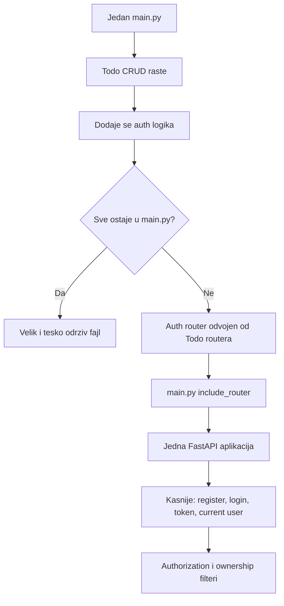

# Oblast 01 - Autentifikacija i Autorizacija

## Lekcija 01 - Početak autentifikacije i autorizacije

Ova lekcija je uvod u novu veliku oblast `FastAPI` aplikacije: `autentifikaciju` i `autorizaciju`.

Transkript još ne implementira pravi `login`, `JWT` ili `proveru lozinke`. Njegov prvi cilj je `organizacioni`:

- `auth` logika ne treba da bude pomešana sa `todo` logikom
- aplikacija treba da ostane `čitljiva` kako raste
- `rute` treba postepeno izdvojiti u posebne `module`
- jedna `FastAPI` aplikacija treba da objedini sve funkcionalne oblasti

To je važno razumeti pre nego što se uvedu `password hashing`, `tokeni` i `permissions`.

---

## 1) Gde se sada nalazimo

Do ove oblasti aplikacija ima todo CRUD logiku u jednom `main.py` fajlu:

```python
@app.get("/")
async def read_all(db: db_dependency):
    return db.query(Todos).all()

@app.post("/todo", status_code=status.HTTP_201_CREATED)
async def create_todo(todo_request: TodoRequest, db: db_dependency):
    new_todo = Todos(**todo_request.model_dump())
    db.add(new_todo)
    db.commit()
    db.refresh(new_todo)
    return new_todo

@app.put("/todo/{todo_id}", status_code=status.HTTP_204_NO_CONTENT)
def update_todo(db: db_dependency,
    todo_request: TodoRequest,
    todo_id: int = Path(gt=0, description="ID todo zadatka mora biti veći od 0")
):

    todo_model = db.query(Todos).filter(Todos.id == todo_id).first()
    if todo_model is None:
        raise HTTPException(status_code=404, detail="Todo nije pronađen.")

    for key, value in todo_request.model_dump().items():
        setattr(todo_model, key, value)

    db.add(todo_model)
    db.commit()
    return todo_model

@app.delete("/todo/{todo_id}", status_code=status.HTTP_204_NO_CONTENT)
def delete_todo(
    db: db_dependency,
    todo_id: int = Path(gt=0, description="ID todo zadatka mora biti veći od 0")
) -> None:
    todo_model = db.query(Todos).filter(Todos.id == todo_id).first()
    # delete_todo = get(Todos, todo_id)
    if todo_model is None:
        raise HTTPException(status_code=404, detail="Todo nije pronađen.")
    # Drugi način za brisanje koji nije vezan za instancu modela i nije preporučen uvek, naročito kada postoji logika vezana za instancu modela

    # db.query(Todos).filter(Todos.id == todo_id).delete()

    db.delete(todo_model)
    db.commit()

```

Ovo je prihvatljivo za početak, jer učiš `osnovni CRUD` i `DB lifecycle`. Problem nastaje kada počneš da dodaješ:

- registraciju korisnika
- login
- proveru password-a
- generisanje tokena
- čitanje trenutnog korisnika
- proveru administratorske role
- ograničavanje pristupa todo zapisima

Ako se sve doda u isti `main.py`, fajl brzo postaje nepregledan.

---

## 2) Tri pojma koje sada uvodimo

### Autentifikacija

`Autentifikacija` odgovara na pitanje:

> Ko si ti?

Primeri:

- korisnik šalje `username` i `password`
- aplikacija proverava da li korisnik postoji u bazi
- aplikacija proverava da li `password` odgovara sačuvanom `hash`-u
- aplikacija `identifikuje korisnika` i vraća informacije o njemu u odgovoru.
- odgovor je u obliku `JSON objekta` i `ne sadrži` osetljive informacije poput `password` ili `hash`.
- `token` za autentifikaciju se može vratiti u odgovoru (npr. `JWT`)
- `token` se koristi za autentifikaciju narednih zahteva.
- `token` se šalje u `header`-u narednih zahteva za autentifikaciju.
- `token` se može `osvežiti` ili `opozvati` po potrebi.

Primer odgovora sa tokenom:

```json
{
    "username": "ana",
    "id": 1,
    "role": "user",
    "token": "eyJhbGciOiJIUzI1NiIsInR5cCI6IkpXVCJ9..."
}
```

Primer odgovora bez tokena:

```json
{
    "username": "ana",
    "id": 1,
    "role": "user",
}
```
---

### Autorizacija

`Autorizacija` odgovara na pitanje:

> Šta smeš da uradiš?

Primeri:

- običan korisnik može da vidi samo svoje todos
- admin može da vidi sve todos
- samo admin može da obrisati korisnika

Autorizacija dolazi nakon autentifikacije, jer aplikacija prvo mora znati ko je korisnik da bi proverila njegova prava.

---

### Routing - organizacija ruta

`Routing` nije autentifikacija, ali je `organizaciona osnova` za nju.

`Auth` endpointi treba da budu odvojeni od `todo` endpointa, na primer:

```text
/auth/login
/auth/register
/todos
/users
/admin
```

---

## 3) Zasto auth ne treba mešati sa todo logikom

Zamisli da `main.py` sadrži sve sledeće:

```python
# todo query logika
# user registration
# password hashing
# login
# JWT tokeni
# admin permissions
# todo ownership
# HTML stranice
```

Svaka od ovih oblasti ima drugu odgovornost.

### Problem održavanja

Ako menjaš login, ne želiš da rizikuješ da pokvariš todo query.

---

### Problem čitljivosti

Kada je svaki endpoint u jednom fajlu, teško je brzo pronaći kod odgovoran za jednu funkcionalnost.

---

### Problem timskog rada

Dve osobe ne mogu udobno menjati isti veliki fajl bez konflikata.

---

### Problem testiranja

Lakše je testirati auth rute odvojeno od todo ruta kada su logički grupisane.

---

## 4) Prvi korak iz transkripta: auth.py

Transkript prvo pokazuje ideju pravljenja novog fajla:

```text
TodoApp/
    main.py
    auth.py
```

U njemu se privremeno definiše nova `FastAPI` aplikacija:

```python
from fastapi import FastAPI

app = FastAPI()


@app.get("/user")
async def get_user():
    return {"message": "user authenticated"}
```

Ovaj primer je namerno jednostavan i demonstracioni.

On još nije prava autentifikacija. Ne postoji:

- `baza` korisnika (tabela `users` u bazi)
- `username/password` provera, tj. validacija korisničkog imena i lozinke, pre nego sto se generiše token `JWT` (JSON Web Token).
- `hash` password-a, pre nego što se upiše u bazu (npr. korišćenjem `bcrypt` ili `passlib`).
- `token` (npr. `JWT`)
- `dependency` za current user  (npr. `Depends(get_current_user)`)
- `provera` ovlaščenja  (npr. `Depends(get_current_active_user)`)

Njegova jedina svrha je da pokaže da je nova ruta u posebnom Python fajlu.

---

## 5) Zašto nova FastAPI instanca nije resenje

Ako u `auth.py` napišeš:

```python
app = FastAPI()
```

dobijas novu, odvojenu FastAPI aplikaciju.

Ako pokrenes:

```bash
uvicorn main:app --reload
```

Uvicorn ucitava `app` iz `main.py`, pa vidi samo rute registrovane u toj aplikaciji.

Ruta iz `auth.py` se ne pojavljuje zato što `auth.py` nije priključen glavnoj aplikaciji.

Ako pokrenes:

```bash
uvicorn auth:app --reload
```

onda pokrećeš drugu aplikaciju. Auth ruta postoji, ali todo rute iz `main.py` više nisu deo te aplikacije.

---

### Zaključak

Ne treba praviti više nezavisnih FastAPI aplikacija za jednu aplikaciju.

Treba imati:

```python
app = FastAPI()
```

u glavnom modulu, a za izdvojene funkcionalnosti koristiti `APIRouter`.

---

## 6) Pravilno rešenje: APIRouter

Umesto nove `FastAPI()` instance u `auth.py`, koristi se `APIRouter`:

```python
from fastapi import APIRouter

router = APIRouter()


@router.get("/user")
async def get_user():
    return {"message": "user authenticated"}
```

`APIRouter` sadrži rute, ali nije samostalna aplikacija.

Zatim se u `main.py` router priključuje:

```python
from fastapi import FastAPI

from .api.routes import auth

app = FastAPI()

app.include_router(auth.router)
```

Sada postoji samo jedna `FastAPI` aplikacija, ali su auth rute fizički odvojene.

---

## 7) Kako se ovo uklapa u tvoju strukturu

Kurs koristi jednostavniju strukturu, na primer:

```text
Project_3/TodoApp/
    main.py
    auth.py
    routers/
```

Tvoj aktivni projekat koristi organizovaniju strukturu:

```text
fast-api-course-my-work/TodoApp/
    __init__.py
    main.py
    models.py
    schemas.py
    api/
        __init__.py
        routes/
            __init__.py
    core/
        __init__.py
        config.py
    db/
        __init__.py
        base.py
        database.py
        session.py
```

Zato se isti koncept kod tebe može organizovati ovako:

```text
TodoApp/
    main.py
    api/
        routes/
            __init__.py
            auth.py
            todos.py
            users.py
            admin.py
```

Ovo nije druga logika. To je samo dublje organizovana putanja.

Kursno:

```python
from .routers import auth
```

Tvoja struktura:

```python
from .api.routes import auth
```

---

## 8) Šta include_router() radi

U `main.py`:

```python
app.include_router(auth.router)
```

FastAPI tada uzima rute iz `auth.router` i registruje ih u glavnoj `app` instanci.

Možeš to zamisliti ovako:

```text
auth.py
    router
        GET /login
        POST /register

main.py
    app.include_router(auth.router)

glavna aplikacija
    GET /login
    POST /register
    GET /todo
    POST /todo
```

Bez `include_router()` router fajl postoji, ali njegove rute nisu dostupne kroz pokrenutu aplikaciju.

---

## 9) prefix i tags za auth oblast

U `auth routeru` se često koristi:

```python
router = APIRouter(
    prefix="/auth",
    tags=["auth"],
)
```

A endpoint može biti:

```python
@router.post("/register")
async def register_user():
    ...
```

Konačna URL putanja je:

```text
POST /auth/register
```

`prefix` utiče na URL. On se dodaje ispred svih ruta definisanih u routeru.

`tags` utiče na grupisanje u Swagger dokumentaciji, ali ne menja URL.

---

## 10) Auth router nije isto što i autentifikacija

Ovo je važna razlika:

- `auth.py` ili `auth` router je organizacioni modul. On definiše rute i logiku vezanu za autentifikaciju. Ne vrši samu autentifikaciju.

- Autentifikacija je stvarni proces provere identiteta. Nju obavlja sama aplikacija kroz odgovarajuće funkcionalnosti.

Auth router može sadržati endpoint-e kao:

```text
POST /auth/register
POST /auth/token
GET /auth/login-page
```

Ali sama činjenica da se fajl zove `auth.py` ne znači da je korisnik autentifikovan.

Prava autentifikacija zahteva dodatnu logiku:

1. pronađi korisnika
2. proveri password
3. izdaj `session` ili `token`
4. validiraj token pri sledećim zahtevima

---

## 11) Šta se uvodi u sledećim lekcijama

Nakon ovog organizacionog uvoda, kursni Project 5 pokazuje krajnji smer:

### Model korisnika

U tabeli `Users` čuvaju se podaci korisnika.

Nikada se ne čuva plain-text password. Čuva se hash:

```text
password koji korisnik unese
    -> password hashing
    -> hashed_password u bazi
```

---

### Password verification

Pri login-u se proverava da li uneseni password odgovara sačuvanom hash-u.

---

### Token

Posle uspešnog login-a aplikacija izdaje access token.

---
### Current user dependency

Sledeći zahtevi šalju token, a dependency određuje trenutnog korisnika:

```python
user: user_dependency
```
---

### Ownership filter

Todo endpoint proverava:

```python
Todos.owner_id == user.get("id")
```

Time korisnik vidi samo svoje zapise.

---
### Admin authorization

Admin endpoint proverava rolu:

```python
user.get("user_role") == "admin"
```

To je autorizacija.

---

## 12) Kursni kod naspram modernije prakse

### Kursni stil

Kursni Project 5 koristi relativno jednostavan raspored:

```text
TodoApp/
    main.py
    database.py
    models.py
    routers/
        auth.py
        todos.py
        users.py
        admin.py
```

To je dobro za učenje jer se lako vidi veza između modula.

---

### Tvoj organizovaniji stil

Tvoj projekat razdvaja:

```text
TodoApp/
    db/
        base.py
        database.py
        session.py
    api/routes/
        auth.py
        todos.py
        users.py
        admin.py
    core/
        config.py
        security.py
```

Prednosti:

- DB konfiguracija i dependency su razdvojeni, što olakšava testiranje i održavanje. (npr. lako se može zameniti testnom bazom)
- rute su grupisane pod API slojem, što olakšava održavanje i skaliranje aplikacije, posebno kada broj ruta raste. (npr. lako se dodaju novi routeri bez menjanja main.py)
- konfiguracija ima svoje mesto u `core/` folderu, što olakšava centralizovano upravljanje podešavanjima aplikacije. Ovo je posebno korisno kada se aplikacija razvija i kada je potrebno menjati konfiguraciju bez direktnog menjanja koda. (npr. lako se menja `SECRET_KEY` ili baza bez menjanja main.py)
- projekat je spremniji za rast i lakše se održava kako se broj modula i funkcionalnosti povećava. Ovo je posebno korisno za veće timove i kompleksnije aplikacije. (npr. lako se dodaju novi moduli i funkcionalnosti bez velikih promena u postojećem kodu)

Mana za početnika:

- više tačkica u relativnim importima
- potrebno je razumeti više slojeva foldera

Nijedan pristup nije "drugi FastAPI". Tvoj pristup je samo arhitektonski organizovanija verzija istog koncepta.

---

## 13) Moderne preporuke koje treba imati na umu

### Jedna FastAPI instanca po aplikaciji

Koristi jednu glavnu `FastAPI()` aplikaciju i vise `APIRouter` objekata. Ovo omogućava modularnost i lakše održavanje koda. (npr. različiti delovi aplikacije mogu biti organizovani u odvojene routere bez menjanja glavnog fajla)

---

### Centralizovani dependency-ji

`get_db` drzi u `db/session.py`, a routeri ga importuju. Ovo omogućava centralizovano upravljanje konekcijama ka bazi i olakšava testiranje. (npr. lako se može zameniti testnom bazom)

---

### Odvoj schemas i models

- SQLAlchemy modeli opisuju bazu (tabele, kolone, relacije)
- Pydantic schemas opisuju HTTP request/response (validacija i serijalizacija podataka)

---

### Tajne ne čuvati u kodu

Project 5 primer sadrži hardkodovan `SECRET_KEY`, što je prihvatljivo samo kao privremeni kursni primer. Ovo nije preporučljivo za produkciju.

Modernije rešenje:

```text
environment variable / secrets manager -> settings -> auth code
```

---

### Password hashing

Ne čuvati password direktno. Koristiti proverenu biblioteku i odgovarajući password hashing algoritam. (npr. `bcrypt`, `argon2`)

---

### Authorization na serveru

Nikada ne verovati `user_id` vrednosti koju klijent proizvoljno pošalje. Identitet treba da dolazi iz validiranog `tokena/session-a`. (npr. iz `current_user` dependency)

---

## 14) Mentalni dijagram prelaza



---

## 15) Samoprovera

1. Da li `auth.py` sa `app = FastAPI()` automatski postaje deo aplikacije pokrenute preko `main:app`?

Ne, `auth.py` sa `app = FastAPI()` ne postaje automatski deo aplikacije pokrenute preko `main:app`. Svaka FastAPI aplikacija je nezavisna, i `main.py` mora eksplicitno uključiti routere iz drugih modula.

2. Zašto `uvicorn auth:app` prikazuje auth rute, ali ne todo rute?

Odgovor: Zato što `uvicorn auth:app` pokreće samo FastAPI aplikaciju definisanu u `auth.py`. Rute iz `main.py` ili drugih modula nisu uključene u ovu instancu aplikacije.

3. Koja je razlika između `FastAPI()` i `APIRouter()`?

Odgovor: `FastAPI()` kreira glavnu aplikaciju, dok `APIRouter()` kreira modularne delove rute koje se kasnije uključuju u glavnu aplikaciju pomoću `app.include_router()`.

4. Šta radi `app.include_router(auth.router)`?

Odgovor: `app.include_router(auth.router)` uključuje rute definisane u `auth.py` (koje su deo `auth.router`) u glavnu FastAPI aplikaciju (`app`). Na taj način modularne rute postaju deo glavne aplikacije.

5. Šta znače `prefix="/auth"` i `tags=["auth"]`?

Odgovor: `prefix="/auth"` dodaje prefiks svim rutama iz `auth.router`, tako da će npr. ruta `/login` postati dostupna kao `/auth/login`. `tags=["auth"]` se koristi za grupisanje ruta u dokumentaciji (Swagger UI) pod oznakom "auth".

6. Da li naziv `auth.py` sam po sebi obezbeđuje autentifikaciju?

Odgovor: Ne, naziv fajla sam po sebi ne obezbeđuje autentifikaciju. Autentifikacija se postiže implementacijom odgovarajuće logike u okviru fajla, kao što su rute za login, registraciju i validaciju tokena.

7. Koja je razlika između autentifikacije i autorizacije?

Odgovor: Autentifikacija je proces provere identiteta korisnika (npr. login), dok je autorizacija proces provere da li autentifikovani korisnik ima pravo da izvrši određenu akciju ili pristupi određenim resursima.

8. Gde bi u tvojoj strukturi stavio `auth.py`?

Odgovor: `auth.py` bi prirodno pripadao u `api/routes/` direktorijum zajedno sa ostalim routerima kao što su `todos.py`, `users.py` i `admin.py`.

9. Zašto se password ne čuva direktno u bazi?

Odgovor: Password se ne čuva direktno u bazi zbog bezbednosnih razloga. Umesto toga, čuva se hash vrednost passworda, što znači da čak i ako neko dobije pristup bazi, neće moći da vidi stvarne lozinke korisnika.

10. Zašto `user_id` iz URL-a nije dovoljan za bezbedno vlasništvo podataka?

Odgovor: `user_id` iz URL-a nije dovoljan za bezbedno vlasništvo podataka jer URL može biti lako manipulisana od strane korisnika. Bez dodatne autentifikacije i autorizacije, korisnik može pokušati da pristupi ili modifikuje podatke drugih korisnika jednostavnom promenom `user_id` u URL-u. Zato je neophodno koristiti mehanizme koji proveravaju identitet korisnika i njihova prava pristupa podacima.

---

## 16) Zaključak

Prva lekcija autentifikacije i autorizacije ne uči još token ili login algoritam. Ona uči kako da se aplikacija pripremi za te teme.

Glavna poruka transkripta je:

> Ne pravi novu FastAPI aplikaciju za svaku funkcionalnu oblast. Napravi jednu glavnu aplikaciju i uključi routere u nju.

Za tvoj projekat to znači:

- trenutni todo CRUD ostaje osnova
- auth se dodaje kao posebna ruta/modul
- `main.py` ostaje centralna tačka sklapanja aplikacije
- `api/routes/` je prirodno mesto za buduće `auth.py`, `todos.py`, `users.py` i `admin.py`
- Project 5 ostaje referenca krajnjeg cilja, ali se ne uči odjednom

Sledeći korak je implementacija prvog `auth` routera preko strukture koju već imaš, bez uvodjenja JWT-a pre nego što kurs dođe do te lekcije.
